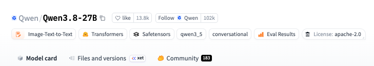
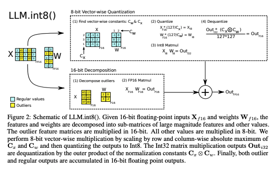
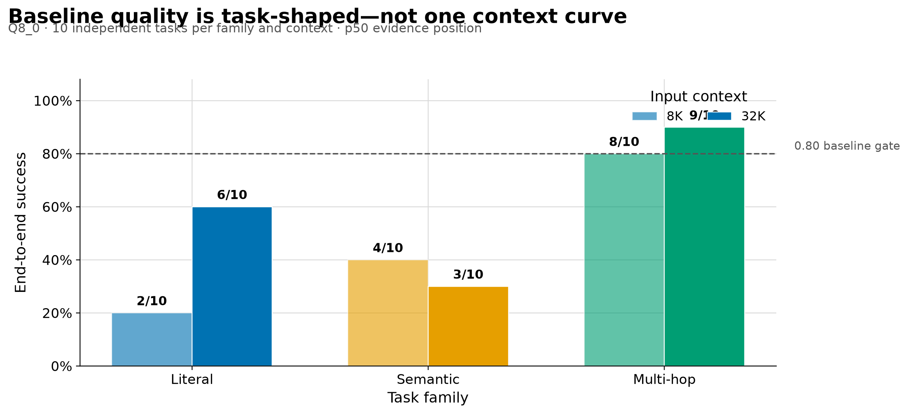
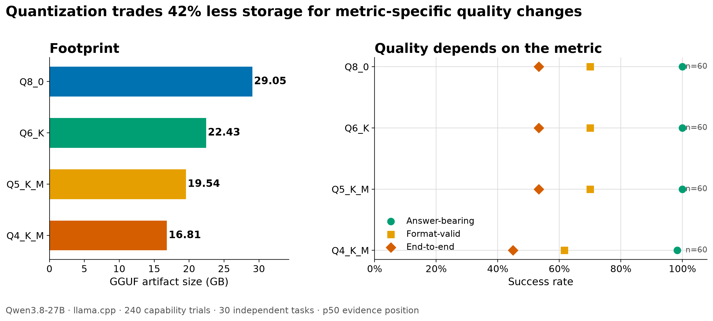
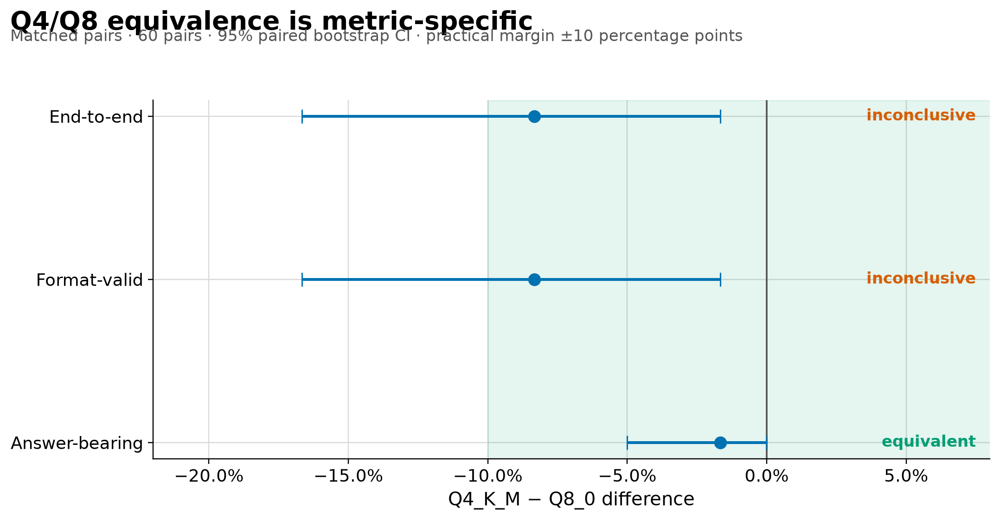
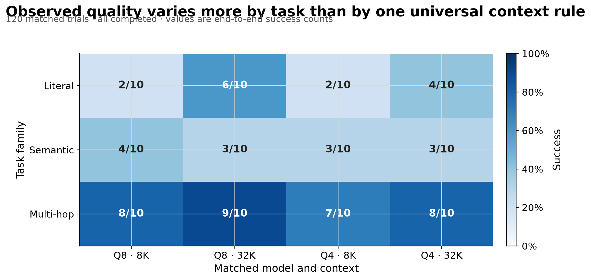
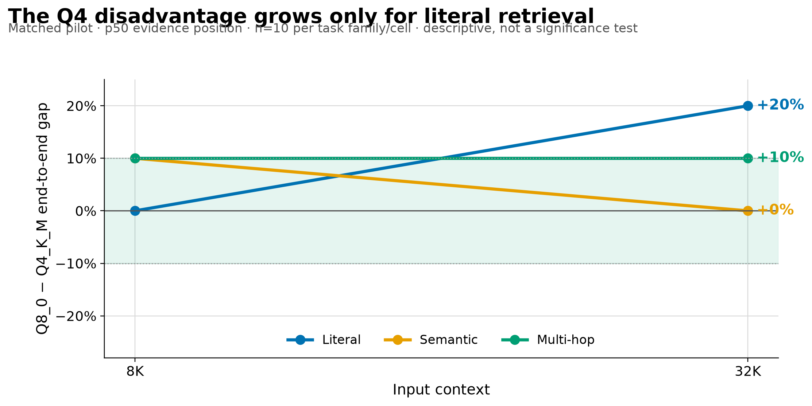
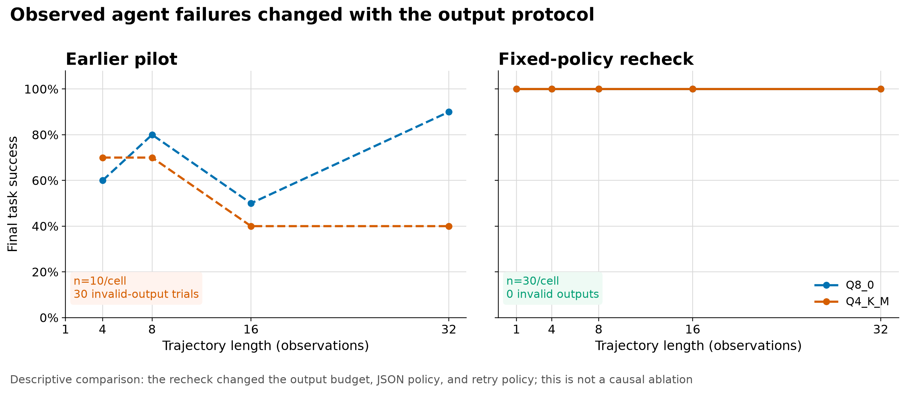
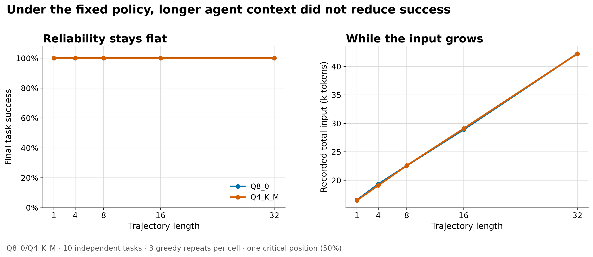

<!-- _paginate: false -->
<!-- _class: slide--title -->

  
QWEN MEETUP TOKYO · LOCAL LLM EXPERIMENTS

  <h1>
    When Does a Local Qwen
     
    Start to Break?
  </h1>
  

  
量子化して、長い文脈を入れて、それでも使えるのか？

  

    Qwen3.8-27B / llama.cpp / Apple Silicon 64GB
     
    Quantization × Context × Evaluation × Agent History
  

---

## WHOAMI

---

## Qwen Model とは？

  Sources: Qwen official blog / Qwen3.8-27B official Hugging Face model repository (checked 2026-09-03)

<!-- ---

## Qwen Model とは？

  

    <h3>Qwen family</h3>
    <ul>
      <li>Qwen Teamが公開する<strong>open-weight LLM family</strong></li>
      <li>reasoning / coding / multilingual / multimodalまで幅広く展開</li>
      <li>ローカル実行の選択肢が多く、実験しやすい</li>
    </ul>
    

      APIで使うモデルだけでなく、<strong>自分のマシンで挙動を観察できるモデル</strong>。
    

  

  

    

      27B
      <small>
         
        今回の対象モデル
         
        Qwen3.8-27B
      </small>
    

    

      

        Apache-2.0
        official model license
      

      

        55.6 GB
        official HF repository footprint
      

    

  

  Sources: Qwen official blog / Qwen3.8-27B official Hugging Face model repository (checked 2026-09-03)

 -->

---

## なぜローカルで動かす？ そして、なぜ量子化する？

  

    <h3>Local LLM の魅力</h3>
    <ul>
      <li>データを外に出さずに試せる</li>
      <li>APIコストやrate limitを気にせず反復できる</li>
      <li>モデル内部の条件を固定して、実験しやすい</li>
    </ul>
    
でも、27Bをそのまま載せるには重い。

  

  

    <h3>Quantization</h3>
    

      

        Q8
        29.05 GB
      

      

        Q6
        22.43 GB
      

      

        Q4
        16.81 GB
      

    

    

      重みを少ないbitで表現して軽くする。 
      では、<strong>軽くした代わりに何を失うのか？</strong>
    

  

Measured artifact size in exp_002 · Q8_0 / Q6_K / Q4_K_M

---

## 　量子化とは

  

    

      
元の重み

      

        −0.93
        −0.62
        −0.11
        ＋0.37
        ＋0.71
        ＋0.94
      

      
細かい値を持つ

    

    
→

    

      
量子化

      
丸める

      
少ないbitで表す

    

    
→

    

      
量子化後

      

        −1.0
        −0.5
        0
        ＋0.5
        ＋1.0
      

      
使う値を減らす

    

  

  

    

      モデルが軽くなる
      容量・メモリを節約
    

    

      トレードオフ
      <strong>少し誤差が入る</strong>
    

  

概念図：重みの表現を粗くして、モデルを軽量化する

---

<!-- 入力 \(X\) と重み \(W\) のうち、普通の値は INT8 で行列積
精度を壊しやすい outlier（黄色）だけ FP16 のまま計算
最後に両者を足して FP16 の出力を作る -->

  Sources: Qwen official blog / Qwen3.8-27B official Hugging Face model repository (checked 2026-09-03)

---

## 今回、知りたかったこと

  

    <h3>RQ1 · Context</h3>
    

      長い文脈を入れたとき、
       
      情報を最後まで正しく使えるか？
    

  

  

    <h3>RQ2 · Quantization</h3>
    

      Q8 → Q4で、
       
      回答能力はどこまで残るか？
    

  

  

    <h3>RQ3 · Interaction</h3>
    

      長い文脈 × 強い量子化で、
       
      劣化は増幅するか？
    

  

  さらに、agent historyまで伸ばしたとき一度見つけた事実を最後まで使えるかも確認した。

---

## “Break” をどう測ったか

  

    

      <h3>Task</h3>
      <pre><code>Context
┌────────────────────────┐
│ distractor / noise     │
│                        │
│  KEY = ZX-4817         │
│                        │
│ distractor / noise     │
└────────────────────────┘

Q: What is the key?</code></pre>
    

  

  

    

      

        <h3>literal</h3>
        
そのまま拾う

      

      

        <h3>semantic</h3>
        
意味を理解して拾う

      

      

        <h3>multi-hop</h3>
        
複数情報をつなぐ

      

    

    

      exact matchだけでなく、<strong>answer-bearing / format-valid / end-to-end</strong>を分離して採点。
    

  

calibrated.v1 · independent tasks · greedy decoding · p50 evidence position unless noted

---

## Context Window は使える長さではない

  

    

      75s → 339.5s
      <small>
         
        median stream-derived TTFT
         
        8K → 32K
      </small>
    

    

      8K / 32Kでは、answer-bearing correctnessは<strong>全セル 10/10</strong>。
    

    

      しかし正答したことと指定形式まで満たしたことは別だった。
    

  

  

    <table class="data-table">
      <thead>
        <tr>
          <th>target</th>
          <th>result</th>
          <th>observed boundary</th>
        </tr>
      </thead>
      <tbody>
        <tr>
          <td>64K</td>
          <td>3/3 complete</td>
          <td>TTFT 783–786s</td>
        </tr>
        <tr>
          <td>128K</td>
          <td>3/3 timeout</td>
          <td>900s · RSS ≈ 37.6GB</td>
        </tr>
        <tr>
          <td>262K</td>
          <td>3/3 timeout</td>
          <td>900s · RSS ≈ 46.2GB</td>
        </tr>
      </tbody>
    </table>
  

入るより先に、待てないが実用上の限界になった。

Q8_0 · baseline 60/60 + feasibility probe 9 attempts · 900s timeout

---

## Feasibility Boundary

Bounded feasibility result — not a model hard limit · 900s timeout per attempt

---

## Q4で −42.1%。では、賢さも42%落ちる？

  

    <h3>Artifact footprint</h3>
    

      

        <b>Q8</b>
        

        29.05 GB
      

      

        <b>Q6</b>
        

        22.43 GB
      

      

        <b>Q5</b>
        

        19.54 GB
      

      

        <b>Q4</b>
        

        16.81 GB
      

    

  

  

    <table class="data-table">
      <thead>
        <tr>
          <th>variant</th>
          <th>end-to-end</th>
          <th>answer-bearing</th>
        </tr>
      </thead>
      <tbody>
        <tr><td>Q8</td><td>32/60</td><td>60/60</td></tr>
        <tr><td>Q6</td><td>32/60</td><td>60/60</td></tr>
        <tr><td>Q5</td><td>32/60</td><td>60/60</td></tr>
        <tr><td>Q4</td><td>27/60</td><td>59/60</td></tr>
      </tbody>
    </table>
    

      answer-bearingではQ4もほぼ維持。 
      <strong>量子化 = 一律に大きく劣化ではなかった。</strong>
    

    

      exact / format / end-to-endの同等性は未確定。
    

  

240/240 completed · Q8_0/Q6_K/Q5_K_M/Q4_K_M · 8K/32K · p50

---

## Footprint vs. Quality, per Metric

Qwen3.8-27B · llama.cpp · 240 capability trials · 30 independent tasks · p50 evidence position

---

## Q4/Q8同等性はメトリック次第

Answer-bearingは同等。End-to-end / Format-validはまだ<strong>inconclusive</strong>。

Matched pairs · 60 pairs · 95% paired bootstrap CI · practical margin ±10pt

---

## Context × Quantization はタスク依存

<table class="data-table u-mt-28">
  <thead>
    <tr>
      <th>task family</th>
      <th>Q8 8K → 32K</th>
      <th>Q4 8K → 32K</th>
      <th>observation</th>
    </tr>
  </thead>
  <tbody>
    <tr>
      <td>literal</td>
      <td>2/10 → 6/10</td>
      <td>2/10 → 4/10</td>
      <td>context-dependent</td>
    </tr>
    <tr>
      <td>semantic</td>
      <td>4/10 → 3/10</td>
      <td>3/10 → 3/10</td>
      <td>≈ constant</td>
    </tr>
    <tr>
      <td>multi-hop</td>
      <td>8/10 → 9/10</td>
      <td>7/10 → 8/10</td>
      <td>≈ constant</td>
    </tr>
  </tbody>
</table>

  

    120/120
    matched trials
  

  

    p50
    evidence position only
  

  

    Not yet
    full position sweep
  

Calibrated matched pilot · descriptive interaction, not significance test

---

## Task ごとの Success Rate

120 matched trials · all completed · values are end-to-end success counts

---

## Q4のハンデが伸びるのは Literal だけ

Q4が常に悪いわけでも、Q4とQ8が常に同じわけでもない。

Matched pilot · p50 evidence position · n=10 per task family/cell · descriptive, not a significance test

---

## Agent History：長い履歴そのものは壊れなかった

  

    

      300/300
      <small>
         
        final task success
         
        trajectory 1 → 32 turns
      </small>
    

    

      

        300/300
        critical-fact reuse
      

      

        0
        planning errors
      

    

  

  

    <h3>むしろ壊れていたのは output protocol</h3>
    <ul>
      <li>以前のpilot：64-token limit → 30件 invalid output</li>
      <li>recheck：128-token JSON + 3 action attempts</li>
      <li>最大completion 109 tokens → 全件成功</li>
    </ul>
    

      履歴長による失敗に見えても、実際には<strong>出力制約</strong>が原因かもしれない。
    

  

Q8_0/Q4_K_M · trajectory 1/4/8/16/32 · 10 tasks × 3 deterministic repeats

---

## Output Protocol を直すと失敗が消えた

Descriptive comparison: the recheck changed the output budget, JSON policy, and retry policy; this is not a causal ablation

---

## 履歴が伸びても Reliability は落ちない

Q8_0/Q4_K_M · 10 independent tasks · 3 greedy repeats per cell · one critical position (50%)

---

## 一番大きな学び：LLMより先に、評価器が壊れる

  

    <h3>Example</h3>
    <pre><code>Expected:
ZX-4817

Model output:
ZX-4817.659</code></pre>
    

      exact matchでは失敗。 
      でも答えを含んでいるか？では別の判定になる。
    

  

  

    

      

        <h3>exact</h3>
        
文字列が完全一致？

      

      

        <h3>answer-bearing</h3>
        
必要な答えを含む？

      

      

        <h3>format</h3>
        
指定形式を守る？

      

    

    
モデルを測る前に、測定器を校正する。

  

Scorer calibration changed the interpretation of exp_001–exp_004

---

<!-- _class: slide--closing -->

  
TAKEAWAY

  <h1>Fits ≠ Useful</h1>
  

  

    Local Qwenは動くか？より、
     
    <strong>どこで・どう壊れるか</strong>を測ると面白い。
  

  

    

      <h3>1 · Quantization</h3>
      
Q4でもanswer-bearingはかなり残った

    

    

      <h3>2 · Context</h3>
      
window sizeより運用コストが先に効く

    

    

      <h3>3 · Evaluation</h3>
      
scorer / format / protocolを分離して見る

    

  

  

    Next: full position sweep → repository-level validation (exp_005)
  

---

## 宣伝
